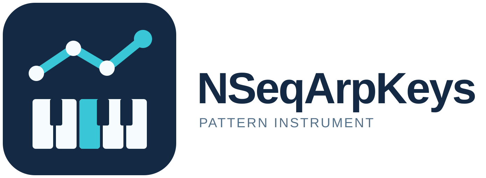

# NSeqArpKeys



NSeqArpKeys is a pattern instrument for Windows, Linux, and macOS. It builds as
a VST3 plug-in; macOS also has an Audio Unit. Each MIDI trigger
key has its own pattern, Forte pitch-class set, channel, octave, Gate, Fixed
Steps, optional subdivision, mode, and expression controls. Hold a key to play
its pattern, or turn on Latch to keep it
playing while you edit. The app produces MIDI notes and has an internal
preview sound.

## Download and install

Download the archive for your OS from the GitHub release. Each archive contains
the VST3 bundle, the user manual, and SHA-256 hashes.
The macOS archive also contains an Audio Unit bundle.

| OS | VST3 folder | Audio Unit folder |
| --- | --- | --- |
| Windows x64 | `C:\Program Files\Common Files\VST3` | — |
| Linux x64 | `~/.vst3` | — |
| macOS Intel / Apple Silicon | `~/Library/Audio/Plug-Ins/VST3` | `~/Library/Audio/Plug-Ins/Components` |

Copy the entire plug-in bundle into the indicated folder, then rescan plug-ins
in your DAW. The macOS build is universal; it is not signed or notarized.

Start with the **Single Note Pulse** factory preset and hold C4 (MIDI 60).
The pattern stops when the key is released. Turn on **Latch (keep playing)**
to hear it while editing. **Stop Key** and **Stop All** end playback.

Turn off **Preview sound** to silence the built-in tones while MIDI continues.
Route the plug-in's MIDI output to your instrument in the DAW and match its MIDI
channel to the assignment's **Channel**. The preview setting is saved with the setup.

The editable [HTML manual](docs/NSeqArpKeys-Manual.html) and
[printable PDF](output/pdf/NSeqArpKeys-Manual.pdf) cover all controls, Forte
sets, presets, and troubleshooting.

## Version 1.3.0 pattern editing

**Global Steps/QN** keeps its host parameter ID and default. The selected
key's **Steps/QN** is 0 to inherit the global value, or 1-16 to override it.
Multiple keys can play at different rates. Timing changes preserve phase.

Choose **Melodic** for Forte-mapped integers or **Rhythmic** for packed drum
lanes. Rhythmic mode accepts 1-16 MIDI pitches. Each pitch has 1-7 velocity
bits, with at most 32 bits total. The default one-bit widths preserve older
16-lane masks: `5` triggers lanes 1 and 3. Zero is a rest; nonzero lane
levels map to velocity 1-127, then scale with base and trigger velocity.
For two lanes with widths `2 3`, step `17` produces levels 1/3 and 4/7.
A signed negative integer can represent a mask with bit 31 set. Set
**Channel** to match the receiving instrument; switching modes preserves it.

The editor shows the sequence length in parentheses after **Pattern**, a
preview of the first 16 steps, and active keys. It shows Forte and Octave
controls in Melodic mode and drum pitches and velocity bits in Rhythmic mode.
A dark theme uses pattern colours in the preview and pattern bank.

**Copy**, **Cut**, **Clear** and **Paste** support full assignments and selective
paste of sequence, timing, or expression. **Duplicate to next key** and
**Assign range** create independent copies. **Pattern Bank** searches names
and tags, filters favourites, and edits name, tags, colour and favourite
status. Assign a bank pattern as an independent copy or a shared link.
Linked keys follow edits to any member; **Make independent** breaks the link.
Right-click the keyboard to assign the selected bank pattern. Whole presets
embed shared pattern definitions, so exported setups reopen without the
local bank. Bank entries can be auditioned from the browser.

**Save pattern** and **Load pattern** use `.nseqpattern` files, separate from
whole `.nseqpreset` files. Loading one pattern affects only the selected key
and can be undone. Undo/Redo lasts for the editor session and resets on a
whole-preset or project restore.

Invalid integer input is outlined in red and leaves the last valid value
playing. Pattern input accepts at most 4096 signed integers and 45,056
characters. Names, tags, preset details, imported files and saved state are
also bounded before use.

The [1.3.0 release notes](docs/release-notes-1.3.0.md) summarize compatibility
and the [user manual](docs/NSeqArpKeys-Manual.html) explains the controls.

## Note lengths

One step lasts `60 / (BPM × effective Steps/QN)` seconds. At 120 BPM and Steps/QN 4,
that is 0.125 seconds. For a sounding step, its span includes the following
zero steps up to the next sounding step, including across the loop boundary.

`note length in steps = Fixed Steps + Gate × sounding span`

Gate ranges from 0 to 2. Fixed Steps ranges from 0 to 16, in increments of
0.01. Both values add to the length; values above one step can make notes
overlap. For example, a span of 3 with Gate 0.5 and Fixed Steps 0.5 lasts
2 steps. Existing presets without Fixed Steps load with a value of 0.

## Presets

The preset browser has six factory examples plus searchable user presets.
Presets capture all 128 key assignments, including Gate and Fixed Steps. You
can save, update, duplicate, favourite, import, export, and delete user
presets. The plug-in formats share the OS application-data folder
`NSeqArpKeys/Presets`. DAW projects also retain their current plug-in state.
To share a preset separately, export a `.nseqpreset` file.

## Build from source

The CMake project uses JUCE 8.0.6. CMake 3.22 or newer and a C++17 compiler
are required. Set `JUCE_SOURCE_DIR` to use an existing JUCE checkout, or let
CMake fetch the pinned JUCE version.

```text
cmake -S . -B build -DCMAKE_BUILD_TYPE=Release
cmake --build build --config Release --target NSeqArpKeys_VST3
cmake --build build --config Release --target NSeqArpKeysTests NSeqArpKeysDomainTests NSeqArpKeysStateTests
ctest --test-dir build -C Release --output-on-failure
```

On macOS, also build `NSeqArpKeys_AU`. For a universal macOS build, configure
with `-DCMAKE_OSX_ARCHITECTURES="x86_64;arm64"` and
`-DCMAKE_OSX_DEPLOYMENT_TARGET=11.0`. Linux needs the JUCE development
packages listed in the [JUCE Linux dependencies guide](https://github.com/juce-framework/JUCE/blob/8.0.6/docs/Linux%20Dependencies.md).
The generated Visual Studio solution under `Builds/VisualStudio2022/` is also
available for Windows builds.

## Package and publish

After a Release build, run:

```text
python scripts/package-release.py --build-dir build --platform windows-x64
```

Use `linux-x64` or `macos-universal` for the matching native build. The script
checks the VST3 manifest version, includes the manual, writes SHA-256 hashes,
and verifies the ZIP. Archives are written to `release/`.

[The GitHub Actions workflow](.github/workflows/build-release.yml) builds and
runs this packaging script on Windows, Linux, and macOS. Every run uploads the
three ZIPs as workflow artifacts. Pushing a `v1.3.0` tag publishes them as a
GitHub release after all three builds succeed.

## Repository map

| Path | Purpose |
| --- | --- |
| `Source/` | Processor, editor, sequencing, Forte data, and preset code |
| `CMakeLists.txt` | Cross-platform JUCE build |
| `NSeqArpKeys.jucer` | JUCE project definition for the generated Windows solution |
| `assets/brand/` | Source logo, app icon, and platform icon assets |
| `docs/NSeqArpKeys-Manual.html` | Editable user manual |
| `output/pdf/NSeqArpKeys-Manual.pdf` | Printable user manual |
| `scripts/package-release.py` | Native distribution packaging and verification |
